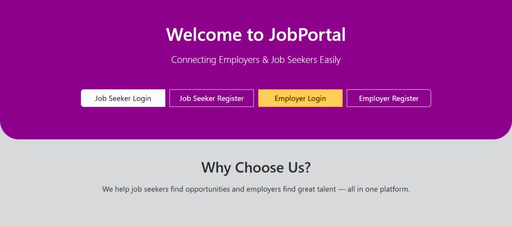
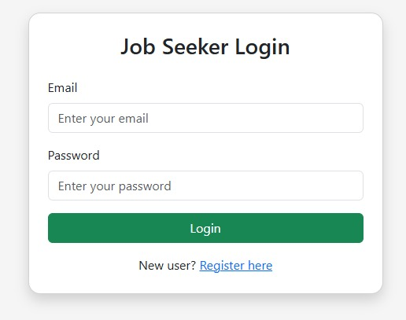

# JobPortal – Online Job Hiring and Applying System

JobPortal is a complete job hiring and job seeking platform built using PHP and MySQL. It includes separate logins for employers and job seekers, with dashboards for posting, applying, and managing job applications.

## 🛠️ Technologies Used
- PHP
- MySQL
- HTML5, CSS3
- JavaScript

## 👤 User Roles
- **Employer**: Can register, log in, post jobs, and view applicants
- **Job Seeker**: Can register, log in, browse jobs, and apply

## ✅ Features
- User and Employer Registration & Login
- Employer dashboard to post and manage jobs
- Seeker dashboard to view jobs and apply
- Admin access to manage users (optional)
- File uploads for CV/resume
- Responsive Design
- Screenshots
| Homepage | Services | Contact |
|-----------|-----------|----------|
|  |  |  |   |

## 📁 Folder Structure
## ⚙️ How to Run Locally
1. Copy the folder to your `htdocs` (XAMPP)
2. Import the SQL database using phpMyAdmin
3. Update `php/dbconfig.php` with your local credentials
4. Access in browser via:  
   `http://localhost/JobPortal/`

